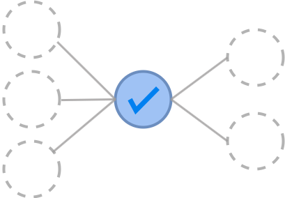
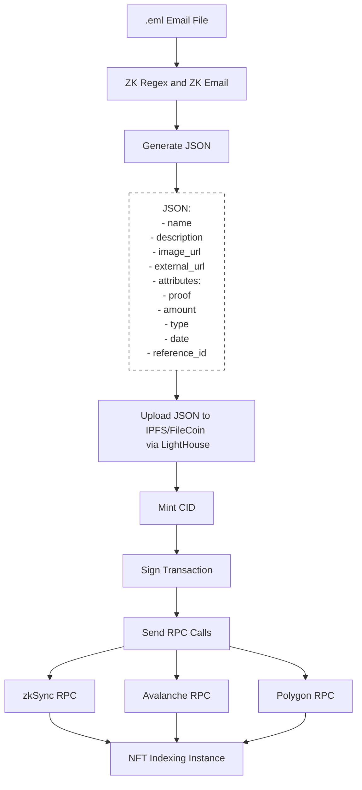

# OpenFlow

 

  

## Project Overview

OpenFlow is a tool designed to ensure transparency in financial transactions while preserving privacy. It leverages zero-knowledge proofs to allow organizations to audit transactions publicly without exposing the identities of the involved third-parties.

Whether you're managing institutional payments, political campaigns, or welfare transactions, OpenFlow ensures transparency without compromising privacy.

## Repository Structure

Find the different parts of this project in the links below.

- **[Demo](https://openflow-frontend.vercel.app/)**: Find in this link a working demo of an OpenFlow campaing on a futbol club fundraiser.
- **[Front-end Code](https://github.com/openflow-labs/openflow-frontend)**: This directory contains the source code for the front-end application, including UI components, state management, and API blockchain integrations.
- **[Smart Contract Code](https://github.com/openflow-labs/openflow-contracts)**: This directory includes the NFT smart contract code. This contract mints the NFTs indexing by the CIDs. ([Avalanche Snowtrace Verified Deployment](https://testnet.snowtrace.io/address/0x9433c1ec92889237f923ac77471aa84bf3ee06ab), [Polygon Amoy Verified Deployment](https://amoy.polygonscan.com/address/0xc2190225340ff87588785d451bba2304384ae488), [ZkSync Sepolia Verified Deployment](https://sepolia.explorer.zksync.io/address/0xA5B1d13395A130C24a2625CFbCbBFA9a482eE393)).
- **[Back-end Code](https://github.com/openflow-labs/openflow-backend)**: This directory contains the source code for the back-end application.
- **[ZK Circuits Code](https://github.com/openflow-labs/zk-email-verifier-poc)**: This directory contains the code for the circuits and all the zk-knowledge logic.

## How does it work?

OpenFlow uses cutting-edge cryptography to balance transparency and privacy in financial transactions. The following steps, illustrated in the accompanying flowchart, summarize how OpenFlow processes an institution's transactions into a traceability report:

1. **Setup Campaign**: Organizations setup and initiate an OpenFlow campaign. They determine on which blockchain the transaction certificates will be minted (e.g., Zksync, Avalanche, Polygon) and establish the payment method (e.g., Mercado Pago).
2. **Register Transactions**: Transactions from third-parties that send funds to the organization, or receive funds from it, are registered by OpenFlow backend, which generates a JSON containing the details of the transaction email and zero-knowledge proof that the transaction occurred, all while keeping identities of these third-parties private.
3. **Upload to Decentralized Storage**: The JSON associated with each transaction is uploaded to IPFS and FileCoin via LightHouse.
4. **Mint NFTs**: NFTs corresponding to these JSONs are minted on the blockchain chosen by the institution.
5. **Real-time Public Reports**: The public can access real-time, transparent reports showing how the funds move and eventually reach their intended destination, ensuring accountability.

## About

**OpenFlow** is an open-source project developed by [Nicolás Biondini](https://github.com/NicolasBiondini), [Yago Pajariño](https://github.com/yagopajarino), [Alejandro Almaraz](https://github.com/almaraz97), [Nicolás Acosta](https://github.com/NicoAcosta) and [Arturo Beccar-Varela](https://github.com/arturoBeccar). With expertise in blockchain, cryptography, and front-end development, we aim to bring trust and privacy to financial transactions.

## Acknowledgements

OpenFlow was initially developed as part of the [Aleph Crecimiento Hackathon, 2024](https://www.aleph.crecimiento.build/en-aleph-hackathon). We participated in this hackathon through the [PSE Core Program](https://pse.dev/en/programs), where we deepened our knowledge of programmable cryptography and zero-knowledge proofs.

In partnership with [D&D Fundacion](https://ddfundacion.org/), we are committed to solving the transparency and privacy challenges that institutions face when handling funds of public interest.

## License

This project is licensed under the AGPLv3 License - see the [LICENSE](LICENSE) file for details. Contact us if you're looking for an exception to the terms.
